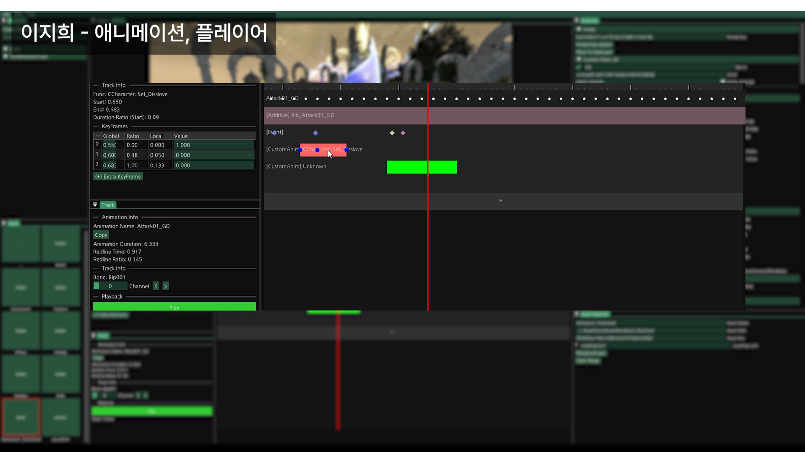

# 명조:워더링 웨이브

팀 프로젝트로 진행한 오픈월드 RPG 3D 모작 게임 프로젝트 중 제가 맡았던 코드만 따로 정리한 repository입니다.

## 프로젝트 정보

- 개발 기간: 2026.04 - 2026.05
- 담당 역할: 애니메이션 / 플레이어
- 개발 인원: 6명
- 개발 환경: C++, DirectX11

## 담당 구현

### 캐릭터 Locomotion 및 애니메이션 시스템

### 회피 시스템

### 전투 액션 및 입력 큐 시스템

### 전투 보정 및 연출 시스템

### 캐릭터 전환

### 무기 연동

### Animation Tool 및 런타임 최적화

## Notes

팀 공용 에셋, 애니메이션 데이터, 외부 라이브러리, 빌드 산출물은 포함하지 않았습니다.  